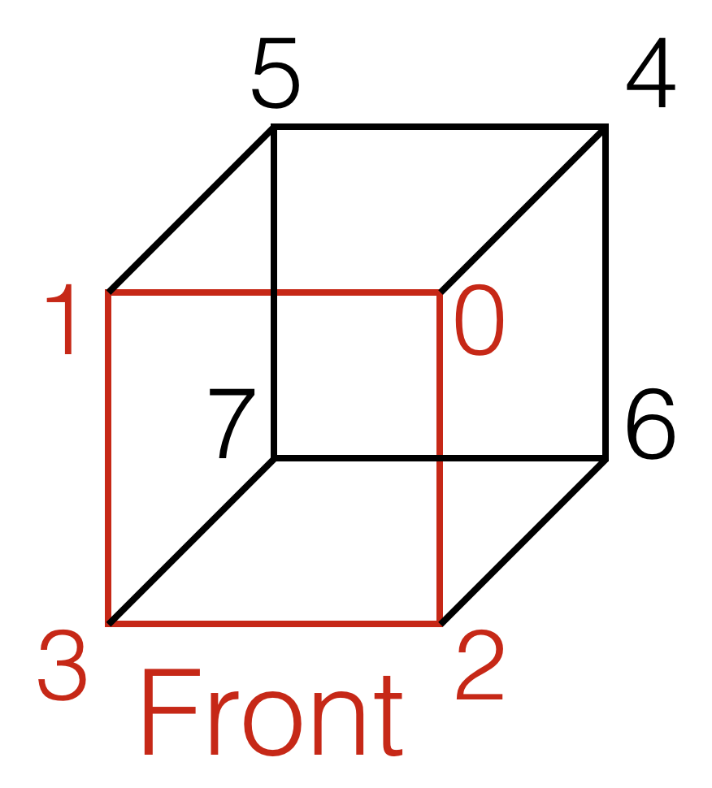

# 3D-Graphics

For this lab, you will be working to draw, move, and rotate a cube.

You may work individually or with a partner of your choosing.

Note to Windows users: remember to copy freeglut.dll from the cmake-build-debug folder of the Graphics-Starter activity to the cmake-build-debug folder here.

Note to Mac users: if you are running Catalina, remember to multiply the width and height by 2 in the glViewport line.

Note to Linux users: remember to use the alternate CMakeLists.txt from the Graphics-Starter activity.

## Setup

Use this Guided Project template to create a new repository (see [GitHub-with-CLion](https://github.com/uvmcs120s2021/GitHub-with-CLion) repo for directions).
**Your repository must be named with the convention: 3D-Graphics-netid**, where netid is your UVM NetID username.
* If you are collaborating, the format is 3D-Graphics-netid1-netid2. Have one partner create the repository and give the other partner access on GitHub: on the repository page, go to the Settings tab, choose Manage Access, and add the person with their GitHub username.

Remember to commit and push frequently.

# Drawing the cube

You can see the x-axis drawn in red, the y-axis drawn in green, and the z-axis drawn in blue. This means that (0, 0, 0) is at the intersection of the axes (no longer in the corner of the window). Note that the positive y-direction is now up.

Below is a labeling of the indices of the cube at its starting position. It will be useful when drawing the faces.



Two faces of the cube have been drawn for you. They are the faces that originally face forward (yellow) and backward (magenta). Don't see the magenta face? That's because it is facing away from you. Use the ```x``` key to rotate the cube. Once the yellow face disappears, the magenta face will appear.

Note that you need to draw a quad's corners widdershins (counter-clockwise) in order for the quad to appear.

**Draw the other four faces of the cube in cyan, white, gray, and purple.** This should be done in the Cube's draw method. The order of the vertices matters when drawing, so it's recommended that you draw one face of the cube at a time to ensure correct implementation.

Note that you should not be able to see some faces until you implement rotation by different axes.

# Moving the cube

Luckily for you, the Cube class already has a partially functional move method! The starter code includes the use of left and right arrow keys to move the cube along the x-axis. 

**Implement movement along the y- and z-axes using other keys.** This will be done by completing the Cube's move method and calling the method in the graphics keyboard listener function(s). Use the up and down arrows for the y-axis movement and the comma and period keys for the z-axis movement.

# Rotating the cube

Also luckily for you, the Cube class's rotate method already has functioning x-rotation. This rotates the cube around its center parallel to the x-axis, which you can see by pressing the ```x``` key. 

**Implement rotation around its center parallel to the y- and z-axes.** This should be done by completing the Cube's rotate method and calling it in the graphics keyboard listener function(s).

# Changing the cube's size

Create functionality using the `g` and `s` keys to grow and shrink the size of the cube by 10%. These operations should be inverse (i.e. if the cube grows by 10% and then shrinks by 10%, it should end up the size it started).
* You will want to add functionality to the Cube class as well as the `kbd` function for this.

## Grading

This project is due on Gradescope by 11:59pm ET on Friday, April 30th.
* If you are collaborating, both partners have to submit on Gradescope.

### Grading Rubric
- [ ] (5 pts) Draw other four faces of cube.
- [ ] (5 pts) Move cube along y- and z-axes.
- [ ] (5 pts) Rotate cube with respect to y- and z-axes.
- [ ] (5 pts) Change the cube's size with the `g` and `s` buttons.